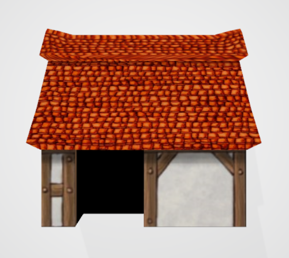
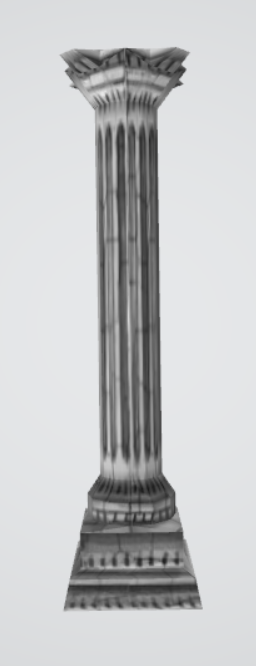
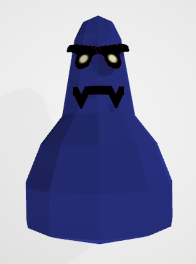
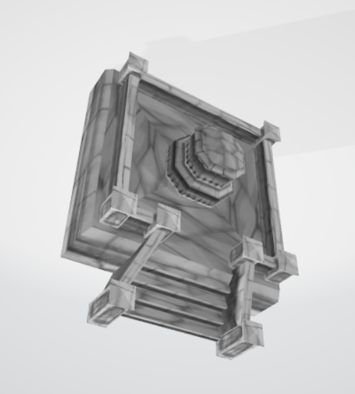

# SoulFu 3D Model Converter (S3MC)

## description
The tool can convert any DDD model from SoulFu data archive (**datafile.sdf**) to OBJ format file. Textures need to be applied manually as they are not part of a DDD file. You can refer to examples in **example/** folder.

## how to use
To convert OBJ model to DDD, run:
```
./s3mc file.obj
```
To convert DDD model to OBJ, run:
```
./s3mc file.ddd
```
As you can see, the type of conversion is deduced from the input file extension.

At the moment S3MC supports conversion of static (not moving) models only. OBJ-to-DDD conversion is a bit clumsy and picky about OBJ format. If I start to use the tool more frequently, I will extend its capabilities and robustness.

## examples
Take a look at textured examples taken directly from the data archive:






