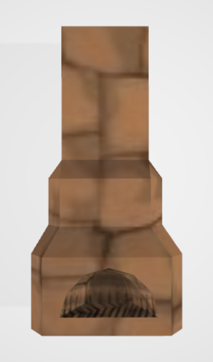

# SoulFu 3D Model Converter (S3MC)

## description
The tool can convert any DDD model from SoulFu data archive (**datafile.sdf**) to OBJ format file. Textures need to be applied manually as they are not part of a DDD file. The example MTL (Material Template Library) file **materials.mtl** can be found in the repository. You can refer to other examples in **example/** folder as well.

## how to use
Well, read the source code. The work is in progress, so the way how to use S3MC can change anytime. Specifically, I plan to implement OBJ->DDD conversion, so after that I will probably prepare more detailed documentation.

## examples
Take a look at textured examples taken directly from the data archive:

